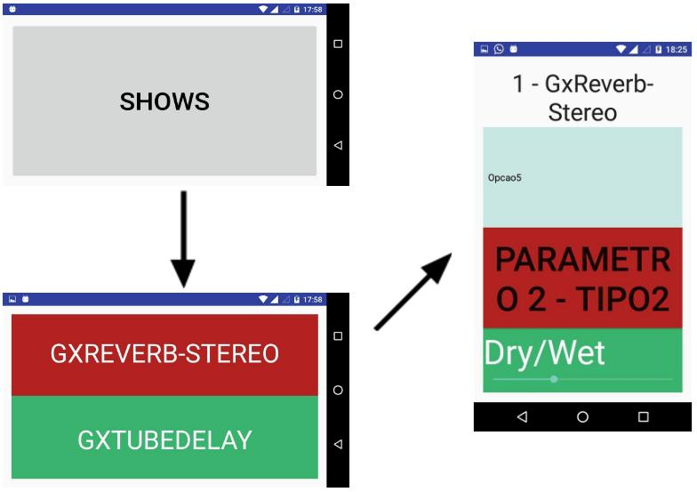

# Android Controller

AndroidController disposes a controller and viewer the principal configurations for the current patch. Your focus is a speed management in live performances.

This code contains the communication with the android [PedalPi-Display-View](https://github.com/p4x3c0/PedalPi-Display-View) apk.



## How to use

Like described in [Application documentation](http://pedalpi-application.readthedocs.io/en/latest/), create a `start.py` and register AndroidController component.

```python
import tornado

from load_module import load_module

load_module('application')
load_module('android_controller')

from application.Application import Application
from android_controller.android_controller import AndroidController

address = 'localhost'
port = 3000

application = Application(data_patch="data/", address=address, test=True)
application.register(AndroidController(application, "adb"))

application.start()

tornado.ioloop.IOLoop.current().start()
```

### Dependencies

**Android Controller** requires `Tornado >= 4.2` for TCP connection with smartphone (over USB) and `adb`.

If you uses in a ARM architecture, maybe will be necessary compile **adb**. In these cases, the project https://github.com/PedalPi/adb-arm can help you.
**adb-arm** PedalPi _fork_ already contains some binaries for RaspberryPi.
